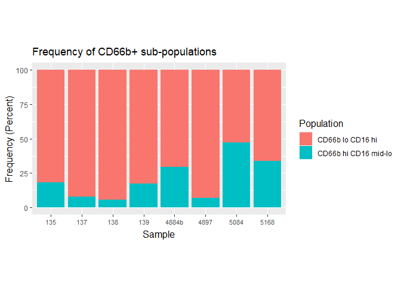
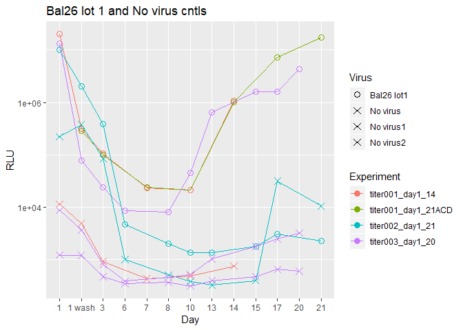

Plot gallery
================
Claire Levy
March 22, 2016

Stacked bar
-----------

CD66b+ populations from "plotting neutrophil subsets flow and April-May CyToF" in the GAPPS-analysis project

``` r
ggplot(meltCombinedData, aes(x=Sample, y = CD66bPos))+
  geom_bar(aes(fill = Population),stat="identity")+
  labs(y="Frequency (Percent)")+
  theme(axis.text.x=element_text(vjust=0.8, size=8),
        axis.title=element_text(size= 12),
        legend.title=element_text(size=12),
        axis.title.x=element_text(vjust=.2),
        plot.title = element_text(vjust=2),
        aspect.ratio = 0.6)+
    ggtitle("Frequency of CD66b+ sub-populations")
```



Stacked bar with pretty colors
------------------------------

Populations found using testing CyToF with PBMC and vaginal cells from "30Apr15 CyTOF data.R" in GAPPS-analysis project

``` r
ggplot(freqMeltStackedBar, aes(x=NewSampleName, y = Frequency))+
  geom_bar(aes(fill=Cell.Type),stat="identity")+
  labs(x="Sample")+
  scale_fill_manual(name="Cell Type",values=c("#1b9e77","#4daf4a","#984ea3",
                             "#e7298a","#80cdc1"))+
  theme(axis.text.x=element_text(angle=20,vjust=.8, size=10),
        axis.title=element_text(size= 15),
        legend.title=element_text(size=15),
        axis.title.x=element_text(vjust=.5),
        plot.title = element_text(vjust=2))+
  ggtitle("Frequency of (live) cell types in cytobrushes, PBMC and vaginal
cell samples")
```


Lotsa dots plus custom error bars
---------------------------------

qPCR results showing all donors and mean + se. From: J:SHAREDstudy-Project-1-qPCRresults.Rmd

The black vertical lines are showing the range of the SE on either side of the mean. This is done using the following:

`stat_summary(fun.data = mean_se, geom = "linerange")`

The black horizontal lines are actually a "+" symbol at the mean. This is done using the following:

`stat_summary(fun.y = mean, geom = "point",shape = 3, size = 6)`

To customize the x and y axis labels I used:

`labs(y = "Fold Change relative to CT of 40 \n (log 10 scale)", x = "Time (hrs)")`

``` r
ggplot(explantAnalysis,(aes(x = Time, y = log10(FoldChange))))+
  geom_point(aes(color = TissueID),size = 3.5 )+
  geom_line(aes(color = TissueID, group = TissueID),size=0.5)+
  scale_color_discrete (name = "Tissue ID")+
  stat_summary(fun.data = mean_se, geom = "linerange")+
  stat_summary(fun.y = mean, geom = "point",shape = 3, size = 6)+
theme(axis.text = element_text(size = 12),
      axis.title.x = element_text(size=12), 
    axis.title.y = element_text(size=12, vjust = 0.6 ),
    strip.text = element_text(size =12))+
facet_wrap(~ Treatment)+
labs(y = "Fold Change relative to CT of 40 \n (log 10 scale)", x = "Time (hrs)")
```


Dots with scientific notation using scales package
--------------------------------------------------

Results of infecting TZM-bl cells with HIV (Bal) in the presence of different amounts of seminal exosomes per pfu. Plot is from the "TZM-bl\_infection\_assay\_001\_003\_004" script.

Note that you need to call `library(scales)` in order to use `scale_y_continuous(labels = scientific)`

``` r
library(scales)

ggplot(dat003Bal3xCntl,aes(x = Condition, y = RLU))+ scale_y_continuous(labels = scientific)+
geom_point(aes(), size = 3)+
ggtitle("Bal data: only reps 3x avg Cells Only control")
```


Using `interaction()` to make `geom_line()` between points that share another aesthetic (color)
-----------------------------------------------------------------------------------------------

I wanted to plot the multiple data sets from each experiment in the same color, but also wanted geom\_line to connect unique instances of virus + experiment, not all the points from one experiment.

I used r`scale_shape_manual()` to make all the "No virus" conditions the same shape, even though they had different names.

``` r
ggplot(Bal26, aes(x = Day, y = RLU))+
  geom_point(aes(color = Experiment, shape = Virus),size = 3)+
  geom_line(aes(group = interaction(Experiment,Virus), color = Experiment))+
  scale_y_log10()+
  scale_shape_manual(values = c("Bal26 lot1" = 1, "No virus" = 4, "No virus1" = 4, "No virus2" = 4 ))+
  ggtitle("Bal26 lot 1 and No virus cntls")
```



Heat map of MSD data
--------------------

-   Use geom\_tile to make the grid

-   Use `scale_fill_gradient()` and assign the colors I want to the hi low and midpoints

-   Set the midpoint to zero

-   Use `scale_y_discrete()` to make sure the labels have the correct greek letters instead of whatever weird symbols ggplot tries to use.

``` r
ggplot(merge24And3, aes(x = Donor, y = Assay))+
  geom_tile(aes(fill = max10fold), color = "gray")+
  scale_fill_gradient2(low = "green", mid = "white", high = "red", midpoint = 0, name = "log10 Fold Change")+
  facet_wrap(~Virus, scales = "free_x")+
  scale_y_discrete(breaks = merge24And3$Assay,labels =merge24And3$Assay)+
  ggtitle("log fold change of concentrations at 24hrs over 3 hrs")
```


